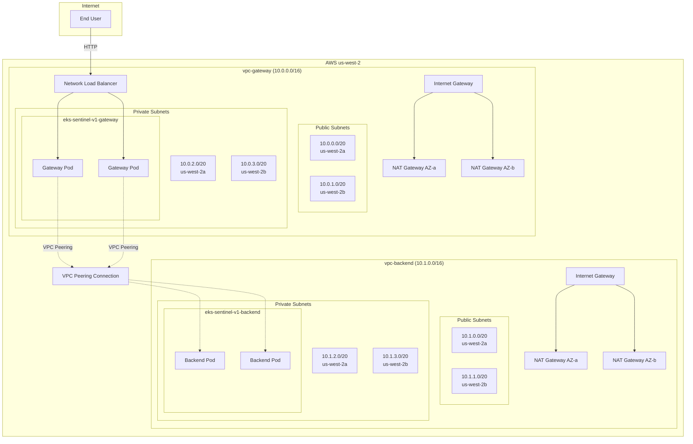
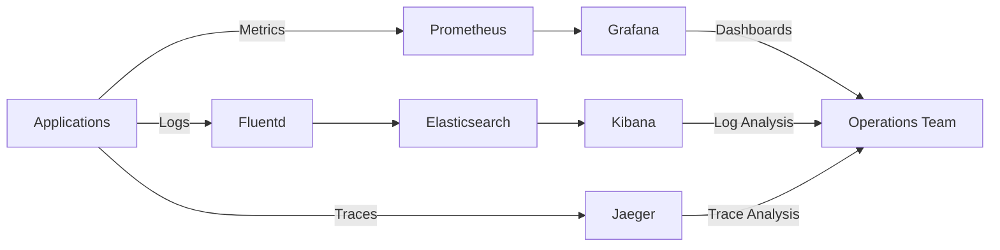

# Sentinel Split - Architecture Deep Dive

This document provides detailed technical architecture documentation for the Sentinel Split project.

## Table of Contents

1. [Network Architecture](#network-architecture)
2. [VPC Design](#vpc-design)
3. [EKS Cluster Architecture](#eks-cluster-architecture)
4. [Traffic Flow](#traffic-flow)
5. [Security Architecture](#security-architecture)
6. [High Availability](#high-availability)
7. [Disaster Recovery](#disaster-recovery)

## Network Architecture

### Overview

The Sentinel Split architecture uses two completely isolated VPCs connected via VPC peering:



### CIDR Allocation Strategy

| VPC | CIDR | Usable IPs | Purpose |
|-----|------|------------|---------|
| **vpc-gateway** | 10.0.0.0/16 | 65,536 | Public-facing services |
| - Public Subnet AZ-a | 10.0.0.0/20 | 4,096 | NAT GW, future ALB |
| - Public Subnet AZ-b | 10.0.1.0/20 | 4,096 | NAT GW, future ALB |
| - Private Subnet AZ-a | 10.0.2.0/20 | 4,096 | EKS nodes |
| - Private Subnet AZ-b | 10.0.3.0/20 | 4,096 | EKS nodes |
| **vpc-backend** | 10.1.0.0/16 | 65,536 | Internal services |
| - Public Subnet AZ-a | 10.1.0.0/20 | 4,096 | NAT GW |
| - Public Subnet AZ-b | 10.1.1.0/20 | 4,096 | NAT GW |
| - Private Subnet AZ-a | 10.1.2.0/20 | 4,096 | EKS nodes |
| - Private Subnet AZ-b | 10.1.3.0/20 | 4,096 | EKS nodes |

**Rationale**: /20 subnets provide ample IP space for Kubernetes pod networking (AWS VPC CNI assigns IPs from subnet range).

## VPC Design

### Routing Tables

#### Gateway VPC

**Public Route Table** (attached to public subnets):
| Destination | Target | Purpose |
|------------|--------|---------|
| 10.0.0.0/16 | local | Intra-VPC traffic |
| 10.1.0.0/16 | pcx-* | Traffic to backend VPC |
| 0.0.0.0/0 | igw-* | Internet access |

**Private Route Tables** (separate per AZ):
| Destination | Target | Purpose |
|------------|--------|---------|
| 10.0.0.0/16 | local | Intra-VPC traffic |
| 10.1.0.0/16 | pcx-* | Traffic to backend VPC |
| 0.0.0.0/0 | nat-* | Egress via NAT Gateway |

#### Backend VPC

Similar structure with 10.1.0.0/16 as local and 10.0.0.0/16 via peering.

### VPC Peering Configuration

```hcl
resource "aws_vpc_peering_connection" "main" {
  vpc_id      = vpc-gateway-id
  peer_vpc_id = vpc-backend-id
  auto_accept = true  # Both VPCs in same account/region
}
```

**Key Settings**:
- **DNS Resolution**: Enabled (allows cross-VPC DNS queries)
- **Requester/Accepter**: Both VPCs in same AWS account
- **Route Propagation**: Manual route entries in each VPC's route tables

## EKS Cluster Architecture

### Cluster Configuration

Both clusters share this configuration pattern:

```yaml
Cluster:
  Name: eks-sentinel-v1-{gateway|backend}
  Version: 1.30
  Endpoint Access:
    Private: true
    Public: true  # For kubectl access
  
  Control Plane Logging:
    - api
    - audit
    - authenticator

  Node Group:
    Instance Type: t3.medium (2 vCPU, 4 GB RAM)
    Desired Capacity: 2
    Min: 2, Max: 4
    AMI: Amazon Linux 2 EKS-optimized
    
  Networking:
    Subnets: Private subnets only
    Security Groups: Custom (cluster + node)
```

### IAM Roles (Following Naming Constraints)

#### EKS Cluster Roles

```
eks-sentinel-v1-gateway-cluster-role
eks-sentinel-v1-backend-cluster-role
```

**Trust Policy**: Allow `eks.amazonaws.com`  
**Managed Policies**:
- `AmazonEKSClusterPolicy`
- `AmazonEKSVPCResourceController`

#### EKS Node Roles

```
eks-sentinel-v1-gateway-node-role
eks-sentinel-v1-backend-node-role
```

**Trust Policy**: Allow `ec2.amazonaws.com`  
**Managed Policies**:
- `AmazonEKSWorkerNodePolicy`
- `AmazonEKS_CNI_Policy`
- `AmazonEC2ContainerRegistryReadOnly`

### OIDC Provider for IRSA

Each cluster has an OIDC provider for IAM Roles for Service Accounts:

```
https://oidc.eks.us-west-2.amazonaws.com/id/{CLUSTER_ID}
```

This enables fine-grained pod-level IAM permissions (future enhancement).

## Traffic Flow

### Inbound Request Flow

```
1. Internet User
   ↓ HTTP/80
2. Network Load Balancer (public subnets in vpc-gateway)
   ↓ TCP/80
3. Gateway Pod (NGINX, eks-gateway cluster)
   ↓ proxy_pass
4. VPC Peering Connection
   ↓ TCP/80, source: 10.0.x.x
5. Backend Pod (Flask, eks-backend cluster)
   ↓ JSON response
6. [Return path reversed]
```

### DNS Resolution Strategy

**Current**: Manual IP configuration in ConfigMap  
**Production Alternative**: AWS Cloud Map or Internal NLB

```yaml
# Current approach
apiVersion: v1
kind: ConfigMap
metadata:
  name: gateway-config
data:
  BACKEND_SERVICE_HOST: "10.1.2.45"  # Pod IP
  BACKEND_SERVICE_PORT: "80"
```

**Why This Works Across Clusters**:
- VPC peering allows direct IP routing
- Security groups and NetworkPolicy enforce access control
- Gateway pods can reach backend pod IPs via peering routes

**Production Improvement**:
```yaml
# AWS Cloud Map service discovery
BACKEND_SERVICE_HOST: "backend.sentinel.internal"
```

### Egress Flow

EKS nodes in private subnets access internet via NAT Gateways:

```
EKS Node → NAT Gateway (in public subnet) → Internet Gateway → Internet
```

**Use Cases**:
- Pulling container images from ghcr.io
- AWS API calls (EKS, ECR, CloudWatch)
- Package updates (yum/apt)

## Security Architecture

### Multi-Layer Defense

```
┌─────────────────────────────────────────────────────────┐
│ Layer 1: Network Isolation (VPC Separation)             │
├─────────────────────────────────────────────────────────┤
│ Layer 2: Security Groups (AWS-level firewall)           │
├─────────────────────────────────────────────────────────┤
│ Layer 3: NetworkPolicy (Kubernetes-level pod filtering) │
├─────────────────────────────────────────────────────────┤
│ Layer 4: RBAC (Kubernetes API access control)           │
├─────────────────────────────────────────────────────────┤
│ Layer 5: IAM (AWS resource access control)              │
└─────────────────────────────────────────────────────────┘
```

### Security Groups

#### Gateway Cluster Node Security Group

**Inbound Rules**:
| Port | Protocol | Source | Description |
|------|----------|--------|-------------|
| 443 | TCP | Cluster SG | API server communication |
| 1025-65535 | TCP | Self | Inter-node communication |
| All | All | NLB SG | LoadBalancer health checks |

**Outbound Rules**:
| Port | Protocol | Destination | Description |
|------|----------|-------------|-------------|
| All | All | 0.0.0.0/0 | Allow all egress |

#### Backend Cluster Node Security Group

**Inbound Rules**:
| Port | Protocol | Source | Description |
|------|----------|--------|-------------|
| 443 | TCP | Cluster SG | API server communication |
| 1025-65535 | TCP | Self | Inter-node communication |
| All | All | **10.0.0.0/16** | **Gateway VPC ONLY** |

**Outbound Rules**:
| Port | Protocol | Destination | Description |
|------|----------|-------------|-------------|
| All | All | 0.0.0.0/0 | Allow all egress |

### Kubernetes NetworkPolicy

Backend pods enforce additional pod-level restriction:

```yaml
apiVersion: networking.k8s.io/v1
kind: NetworkPolicy
metadata:
  name: backend-allow-gateway
spec:
  podSelector:
    matchLabels:
      app: backend
  policyTypes:
  - Ingress
  ingress:
  - from:
    - ipBlock:
        cidr: 10.0.0.0/16  # Gateway VPC CIDR
    ports:
    - protocol: TCP
      port: 8080
```

**How It Works**:
- Default deny-all for pods with label `app: backend`
- Explicitly allow ingress from 10.0.0.0/16 (gateway VPC)
- Works across clusters because VPC peering preserves source IPs
- Additional layer beyond security groups for defense in depth

### Why Backend is Not Publicly Accessible

1. **Service Type**: `ClusterIP` (internal only, no LoadBalancer)
2. **Subnet Placement**: Nodes in private subnets (no public IPs)
3. **Security Group**: No inbound rules from 0.0.0.0/0
4. **No Ingress Controller**: No ALB/NLB exposing backend pods
5. **NetworkPolicy**: Explicit restriction to gateway VPC CIDR

**Verification**:
```bash
# This will fail - backend has no public endpoint
curl http://<BACKEND_POD_IP>:8080
# Error: Connection timeout

# Only works from within gateway cluster
kubectl --context eks-sentinel-v1-gateway exec -it deployment/gateway-proxy -- \
  curl http://<BACKEND_POD_IP>:8080
# Success: {"message": "Hello from backend"}
```

## High Availability

### Multi-AZ Deployment

All components span multiple availability zones:

- **2 Private Subnets** per VPC (us-west-2a, us-west-2b)
- **2 NAT Gateways** per VPC (one per AZ)
- **EKS Control Plane**: AWS-managed across 3 AZs
- **Application Pods**: 2 replicas, spread across AZs

### Failure Scenarios

| Failure | Impact | Recovery |
|---------|--------|----------|
| **Single NAT Gateway down** | Nodes in that AZ lose internet | Route to other AZ's NAT (cross-AZ traffic charges) |
| **Single AZ failure** | 50% capacity loss | Remaining AZ handles traffic, auto-scaling can add nodes |
| **Pod crash** | No user impact | Kubernetes restarts pod (liveness probe), traffic to healthy pods |
| **Node failure** | Pods rescheduled | Auto-scaling group launches replacement node |
| **VPC Peering failure** | Complete service outage | Manual intervention required (AWS support) |

### Load Balancing

- **Gateway**: NLB distributes across gateway pods (round-robin)
- **Backend**: Service load-balances across backend pods (via kube-proxy)

## Disaster Recovery

### Backup Strategy

**State Storage**:
- **Terraform State**: Local (should be S3 + DynamoDB for production)
- **Kubernetes State**: etcd (AWS-managed, encrypted, automatically backed up)

**Application State**:
- Stateless applications (no persistent volumes currently)
- Future: EBS snapshots for PersistentVolumes

### Recovery Time Objectives

| Scenario | RTO (Recovery Time) | RPO (Data Loss) |
|----------|-------------------|-----------------|
| **Pod failure** | ~30 seconds | None (stateless) |
| **Node failure** | ~3-5 minutes | None |
| **AZ failure** | Immediate (other AZ) | None |
| **Region failure** | Not configured | Full |
| **Terraform destroy + recreate** | ~20 minutes | Application state only |

### Business Continuity Recommendations

1. **Multi-Region**: Replicate to us-east-1 for regional failures
2. **Database Replication**: When stateful services are added
3. **GitOps**: ArgoCD for automatic redeployment from Git
4. **Backup Automation**: Velero for Kubernetes cluster backups
5. **RTO < 1 hour**: Automated disaster recovery playbooks

## Monitoring & Observability (Future)

### Recommended Stack



**Current State**: CloudWatch Logs only (EKS control plane logs)

**Production Requirements**:
- Prometheus + Grafana for metrics and dashboards
- ELK or CloudWatch Insights for log aggregation
- Jaeger or X-Ray for distributed tracing
- SNS/PagerDuty for alerting

## Scalability Considerations

### Current Limits

- **Nodes**: 2-4 per cluster (t3.medium)
- **Pods**: ~17 pods per node (AWS VPC CNI limit)
- **Throughput**: Limited by t3.medium network (up to 5 Gbps)

### Scaling Strategies

**Horizontal Pod Autoscaling** (not configured):
```yaml
apiVersion: autoscaling/v2
kind: HorizontalPodAutoscaler
metadata:
  name: backend-hpa
spec:
  scaleTargetRef:
    apiVersion: apps/v1
    kind: Deployment
    name: backend-service
  minReplicas: 2
  maxReplicas: 10
  metrics:
  - type: Resource
    resource:
      name: cpu
      target:
        type: Utilization
        averageUtilization: 70
```

**Cluster Autoscaler** (not deployed):
- Automatically adds/removes nodes based on pod scheduling needs
- Integrates with AWS Auto Scaling Groups

**VPC Capacity**:
- /20 subnets support up to 100+ nodes each
- Peering supports up to 125 peering connections per VPC
- No concerns for foreseeable growth

## Cost Analysis

### Monthly Cost Breakdown

```
EKS Control Plane: 2 × $73         = $146
NAT Gateways:      4 × $32         = $128
EC2 Nodes:         4 × t3.medium   = ~$60
Network LB:        1 × $16         = $16
Data Transfer:     ~50 GB          = ~$5
────────────────────────────────────────
Total:                               ~$355/month
```

### Cost Optimization Strategies

**Immediate** (Dev/Test):
- Single NAT per VPC: **-$64/mo**
- t3.small instances: **-$30/mo**
- Shutdown nights/weekends: **-40%** overall

**Advanced**:
- Spot instances: **-70%** on compute
- Fargate: Pay only for pod runtime
- Reserved instances: **-40%** (1-year commitment)
- VPC endpoints: Reduce NAT data transfer charges

---

## Appendix: Key Terraform Modules

### VPC Module Interface

```hcl
module "vpc_example" {
  source      = "./modules/vpc"
  name_prefix = "example"
  vpc_cidr    = "10.X.0.0/16"
  tags        = {}
}

# Outputs
vpc_id                  → VPC ID
private_subnet_ids      → List of private subnet IDs
public_subnet_ids       → List of public subnet IDs
private_route_table_ids → List of private route table IDs
```

### EKS Module Interface

```hcl
module "eks_example" {
  source          = "./modules/eks"
  cluster_name    = "eks-sentinel-v1-example"
  cluster_version = "1.30"
  vpc_id          = module.vpc.vpc_id
  subnet_ids      = module.vpc.private_subnet_ids
  
  instance_type    = "t3.medium"
  desired_capacity = 2
  min_capacity     = 2
  max_capacity     = 4
  
  peer_vpc_cidr = "10.Y.0.0/16"  # For security group rules
  tags          = {}
}

# Outputs
cluster_endpoint           → EKS API endpoint
cluster_security_group_id  → Cluster security group
node_security_group_id     → Node security group  
oidc_provider_arn          → IRSA OIDC provider
```

### VPC Peering Module Interface

```hcl
module "vpc_peering" {
  source      = "./modules/vpc-peering"
  name_prefix = "gw-be"
  
  vpc_id_requester = module.vpc_gateway.vpc_id
  vpc_id_accepter  = module.vpc_backend.vpc_id
  
  requester_vpc_cidr = "10.0.0.0/16"
  accepter_vpc_cidr  = "10.1.0.0/16"
  
  requester_route_table_ids = module.vpc_gateway.private_route_table_ids
  accepter_route_table_ids  = module.vpc_backend.private_route_table_ids
  
  tags = {}
}

# Outputs
peering_connection_id     → Peering connection ID
peering_connection_status → Active/Pending/Failed
```

---

**Document Version**: 1.0  
**Last Updated**: February 2026  
**Author**: Sentinel Split Team
